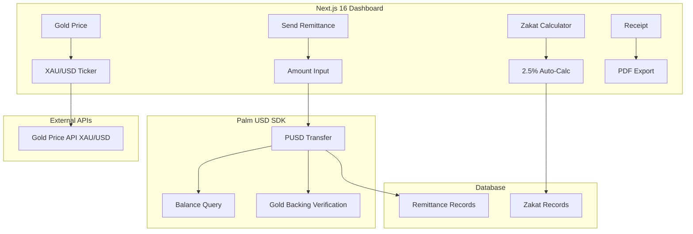

# Zakflow — Technical Architecture

## System Architecture



## Tech Stack

| Layer | Technology |
|---|---|
| **Frontend** | Next.js 16, React 19, Tailwind v4 |
| **Token** | PUSD SDK |
| **Data** | Gold Price API (XAU/USD) |
| **Database** | Supabase |
| **PDF** | jsPDF |

## PUSD SDK Integration Map

| Feature | Use Case | Depth |
|---|---|---|
| **Token Transfer** | Send PUSD from sender to recipient | 🟢 Core |
| **Balance Query** | Check sender/recipient balances | 🟢 Core |
| **Gold Backing** | Verify 1 PUSD = X oz gold | 🟢 Star Feature |

## API Routes

| Method | Path | Description |
|---|---|---|
| POST | `/api/remittance/send` | Send PUSD + auto-calculate Zakat |
| GET | `/api/gold/price` | Fetch live XAU/USD price |
| GET | `/api/remittance/history` | User's remittance history |
| POST | `/api/receipt/generate` | Generate PDF receipt |

## Database Schema

```sql
CREATE TABLE remittances (
    id UUID PRIMARY KEY DEFAULT gen_random_uuid(),
    sender_wallet TEXT NOT NULL,
    recipient_wallet TEXT NOT NULL,
    amount NUMERIC NOT NULL,
    zakat_amount NUMERIC DEFAULT 0,
    gold_price_at_time NUMERIC,
    gold_oz_equivalent NUMERIC,
    tx_signature TEXT,
    created_at TIMESTAMPTZ DEFAULT NOW()
);
```
